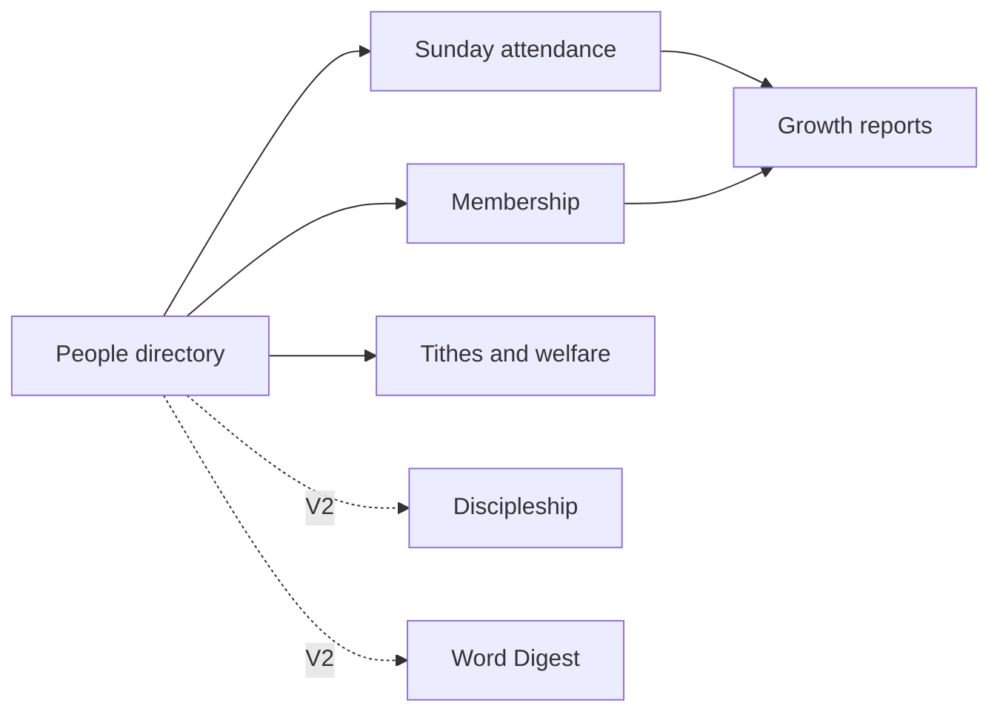

<div align="center">

# ⛪ Eglise

### Know people. Organize church life. Support growth.

Eglise is a church administration platform designed around a simple idea: give administrators reliable records, then give pastors and leaders a clear picture of the people behind the numbers.


[Read the Storybook](product-storybook.md) · [Review the Requirements](requirements.md) · [Open the Project Board](https://github.com/users/Elvis020/projects/8/views/1)

</div>

---

## The product picture

Eglise starts with the church's administrative foundation and grows into care and learning without creating disconnected systems.



One shared person record connects the journey. Access stays appropriate to each responsibility.

## V1 in one Sunday

1. An administrator adds an eligible person or imports existing records from a spreadsheet.
2. Staff open the correct Sunday service and find the person by name.
3. Staff mark the person present; Eglise calculates recorded attendance automatically.
4. The administrator corrects mistakes and completes the service record.
5. Eglise turns those records into reports the administrator discusses with pastors and leaders.

## What V1 includes

| Area | First release |
| --- | --- |
| 👥 People | Manual registration, spreadsheet import, visitor and membership history. |
| ✅ Attendance | Individual Sunday check-in and automatically calculated totals. |
| 📈 Growth | 30-day visitor return, 90-day membership conversion, and longer-term attendance retention. |
| 🗂️ Membership | Administrator-managed cohort recognition after Assimilation paperwork. |
| 💰 Tithes | Restricted person-level records and period totals. |
| 🤝 Welfare | Member contributions and assistance given to members, recorded separately. |
| 🔐 Access | Staff permissions, private data boundaries, audit history, backups, and recovery. |

## Decisions that shape the pilot

- The first launch serves one church.
- V1 focuses on administration; Discipleship and Word Digest follow in V2.
- Sunday services come first, with other days configurable later.
- Administration-heavy work is designed primarily for desktop, while check-in remains fast and usable on phones and tablets over 3G.
- A valid Ghanaian or international phone number is required; shared numbers are allowed.
- Minimum registration age starts at 16 and can change. Existing people keep eligibility after an increase.
- Date of birth is stored privately to apply the age rule and is never displayed or exported.
- Attendance totals come from distinct check-ins and represent the registered pilot population, not everyone physically present.
- Administrators operate attendance and growth reports, then discuss the findings with pastors and leaders.
- Individual tithe and welfare records remain restricted; pastors see summary totals only.
- WhatsApp and Telegram remain the communication channels for now.

## Read the product book

The main [Product Storybook](product-storybook.md) is intentionally short. It links to focused chapters:

1. [Product vision and roadmap](docs/product-vision.md)
2. [People and membership](docs/people-and-membership.md)
3. [Sunday attendance and reporting](docs/attendance-and-reporting.md)
4. [Tithes and welfare](docs/finance-and-welfare.md)
5. [Discipleship and Word Digest](docs/discipleship-and-word-digest.md)
6. [Communication and later possibilities](docs/communication-and-future.md)
7. [End-to-end journeys](docs/user-journeys.md)
8. [Technical approach](docs/technical-approach.md)

For detailed rules, edge cases, and acceptance criteria, see [requirements.md](requirements.md). The original [voice notes](voice_notes.md) remain preserved as source material.

## Releases as chapters

```text
V1      Administration — people, attendance, reports, tithes, welfare
V1.1    Proposed resource links — Church Notes, sermons, church channels
V2      Care and learning — Discipleship and Word Digest
Later   Member access, QR check-in, and evidence-backed integrations
```

These are scope boundaries, not promised dates.

## How work moves

```text
Todo → Discuss and agree → In Progress → Verify → Done
```

Every implementation item begins in the [Eglise Project](https://github.com/users/Elvis020/projects/8/views/1). Tasks remain **Todo** while the product picture is still being shaped. Moving a task to **In Progress** means implementation has actually begun; **Done** means its agreed acceptance criteria have been met.

## Repository map

```text
.
├── README.md                 Product introduction
├── product-storybook.md      Short book cover and chapter index
├── requirements.md           Detailed requirements and decisions
├── voice_notes.md            Preserved source conversation
└── docs/                     Focused product chapters
```

## Current status

Eglise is in **product discovery**. The storybook, requirements, and Project tasks are being refined together before technology choices or application implementation begin.
