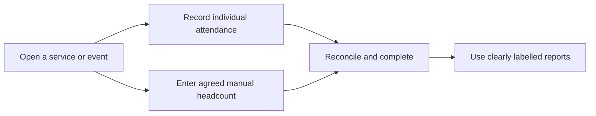

# Attendance and reporting

[← Back to the Product Storybook](../product-storybook.md)

## Status: next

Attendance follows the people foundation. The meeting widened the earlier Sunday-only, calculated-only direction: the team must discover how the church records attendance across services and events before locking the data model.

## Proposed event workflow

### Confirmed context

- Detailed administration is desktop-friendly; service/event entry must work on phones and tablets over ordinary 3G.
- A person can participate in more than one service. Individual records must not create duplicate attendance for the same person in the same event.
- Attendance, membership, and spiritual growth are different concepts.
- Corrections need a clear history once individual attribution is available.

### Discovery to validate with the church

- The event/service types, schedule, teams, and what “complete” means.
- When individual attendance is expected, when a manual headcount is needed, and whether both can coexist for the same event.
- How a manual total is labelled, reconciled against individual records, corrected, and included in reporting.
- Devices, connectivity, paper/manual fallback, delayed entry, and responsibility for reconciliation.
- Which reports are genuinely useful and whether DigiReach needs a follow-up list, handoff, status, or another workflow.

## Reporting guardrails

Any report must label its population, window, and source. It must distinguish individual attendance from manual headcounts and avoid adding them together as though they are separate people. The earlier proposed 30-day return, 90-day membership-conversion, and longer-term retention measures remain candidates, not final requirements, until the church validates their definitions and data coverage.

## Open data rules

Retention, access, exports, correction authority, and what a shared-account pilot can safely report remain unresolved. No sensitive attendance or follow-up workflow should treat the temporary account as individual attribution.

See [requirements.md](../requirements.md#attendance-and-reporting) for the acceptance starting point.
