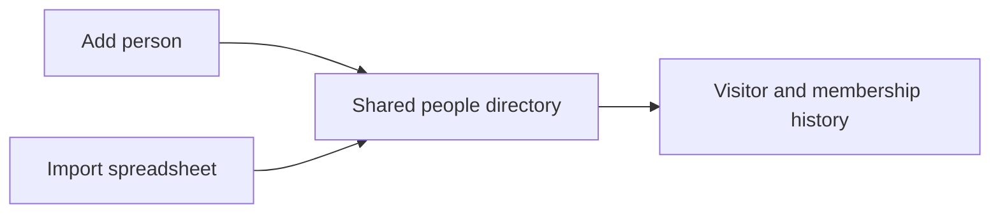

# People and membership

[← Back to the Product Storybook](../product-storybook.md)

## Purpose

Know who is part of the church community, recognize returning people, and preserve each person's membership journey.

## The welcome desk

The people directory starts with two entry routes:

### Required information

- Name.
- Valid phone number.
- Date of birth, stored privately to apply the adjustable minimum-age rule.

Ghana (`+233`) is the default phone context, but valid international numbers are supported. Two people may share the same phone number and remain separate records. Phone is contact information, not a unique identity.

## Pilot audience and age rule

- Minimum registration age starts at 16.
- An authorized administrator can adjust the minimum later.
- Raising it affects new registrations only. Existing people keep check-in eligibility.
- Lowering it permits newly eligible registrations.
- Age-rule changes never delete people or rewrite earlier records.

### Hidden date of birth

An authorized administrator enters or corrects date of birth so the system can calculate eligibility. After saving, the exact date does not appear in:

- Profiles or the directory.
- Search or check-in results.
- Reports or exports.
- Audit descriptions or logs.

Other users see only whether the person is eligible. A correction records that a change occurred without storing the date in the audit message.

## Import story

The church already has spreadsheets, but their exact structure has not been reviewed. Import begins with a name, phone, and hidden date-of-birth destination model.

Before committing an import, the administrator sees:

- Valid rows.
- Missing or invalid phone numbers.
- Missing or invalid dates of birth.
- Possible duplicate people.
- Repeated or shared phone numbers that are not automatically treated as duplicates.

Importing someone creates a directory record. It does not record a visit or mark the person present.

## Membership story

Membership begins through the church's Assimilation and paperwork process, not through attendance frequency.

In V1, the administrator:

1. Selects the people covered by the completed paperwork.
2. Reviews the cohort and removes any exceptions.
3. Marks the eligible cohort as members in one action.
4. Records the membership recognition date, basis, and responsible administrator for each person.

No separate pastor approval step is required in the application. In V2, the same action connects to the actual Word Digest Assimilation cohort.

## Boundaries

- A person record does not automatically create an application account.
- Attendance does not automatically make someone a member.
- A shared phone number alone is not evidence of a duplicate.
- Previously recorded visits remain visitor visits when someone later becomes a member.
- Imported existing members need an agreed legacy classification; the system must not invent class history.

## Open decisions

- The exact fields and column names in the existing spreadsheets.
- How much historical people and membership data to migrate.
- Whether to record certificate number, issue date, or both.
- Inactive, transferred, archived, and other record-status definitions.
- Date-of-birth retention and deletion rules.

See the complete rules in [requirements.md](../requirements.md#72-people-and-membership).
