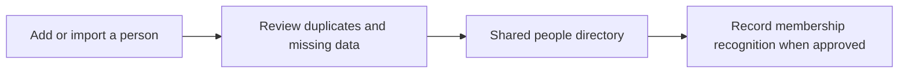

# People and membership

[← Back to the Product Storybook](../product-storybook.md)

## Status: start now

This is the first operational slice. It gives the church one dependable person record before attendance, care, or learning processes add their own activity.

## Confirmed foundation

- Staff can add a person manually or import an agreed spreadsheet shape.
- Name and a valid Ghanaian or international phone number are required. A phone is contact information, not a unique identity; shared numbers remain valid.
- Date of birth is held privately only to apply the adjustable minimum registration age, initially 16. It is not shown in ordinary profiles, search, reports, exports, or audit text.
- A later age increase affects new registrations; people previously eligible retain their recorded attendance eligibility. No age-rule change deletes people or rewrites history.
- Membership follows the church's recognition and paperwork process. Attendance does not create membership.

## First workflow

An import preview must show invalid rows and possible duplicates without treating shared numbers as duplicates automatically. Importing a person never records attendance.

## Pilot access limitation

The temporary shared pilot account may create or edit records, but it cannot say which individual performed a change. That limitation must be visible in pilot documentation and is not acceptable as the eventual audit model.

## Discovery and open decisions

- Existing spreadsheet columns, historical migration depth, merges, transfers, and inactive/archived status.
- The final people fields and membership evidence to retain.
- The privacy notice, retention period, correction/deletion process, permissions, and full-export process.
- The role matrix and named attribution needed after the shared-account pilot.

## Next operational priorities

The current prototype proves the intended shape of person records, staged relationship history,
and deliberate membership recognition. The next work should make those workflows dependable before
starting attendance discovery.

1. **Turn spreadsheet review into a real import.** Provide a versioned sample workbook, parse an
   uploaded file, map its columns to the agreed schema, and present row-level validation before
   anyone is created. The sample file remains the reference contract and must be easy to replace
   when the church agrees new fields.
2. **Make duplicate review actionable.** Let staff compare an imported row with a possible existing
   person, then explicitly create separately, exclude the row, or defer it. Shared phone numbers
   must remain valid and must never trigger an automatic merge.
3. **Complete person-record operations.** Agree and implement the safe paths for correcting data,
   archiving inactive records, transfers, and the rare human-reviewed merge. Each operation needs
   an explanation and history rather than silent mutation.
4. **Confirm the membership policy.** Agree the evidence/reference format, who may recognise or
   correct membership, whether recognition can be withdrawn, and how historical changes are shown.
5. **Introduce named access before real data.** Use Supabase Auth and tenant-scoped RLS for church
   isolation, then add roles and attributable audit records. The shared prototype account is not a
   substitute for this control.
6. **Prove the workflow with representative synthetic data.** Test manual entry, import, duplicate
   choices, visitor progression, membership correction, narrow screens, and recovery from an
   interrupted import before admitting real records.

Attendance, headcounts, and reports remain a later discovery track; they must not be used to infer
membership or bypass the people-record controls above.

See the detailed register in [requirements.md](../requirements.md#people-and-membership).
