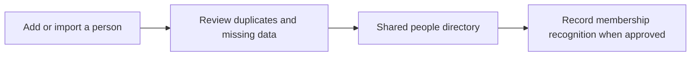

# People and membership

[← Back to the Product Storybook](../product-storybook.md)

## Status: start now

This is the first operational slice. It gives the church one dependable person record before attendance, care, or learning processes add their own activity.

## Confirmed foundation

- Staff can add a person manually or import an agreed spreadsheet shape.
- Name and a valid Ghanaian or international phone number are required. A phone is contact information, not a unique identity; shared numbers remain valid.
- Date of birth is held privately only to apply the adjustable minimum registration age, initially 16. It is not shown in ordinary profiles, search, reports, exports, or audit text.
- A later age increase affects new registrations; people previously eligible retain their recorded attendance eligibility. No age-rule change deletes people or rewrites history.
- Membership follows the church's recognition and paperwork process. Attendance does not create membership.

## First workflow

An import preview must show invalid rows and possible duplicates without treating shared numbers as duplicates automatically. Importing a person never records attendance.

## Pilot access limitation

The temporary shared pilot account may create or edit records, but it cannot say which individual performed a change. That limitation must be visible in pilot documentation and is not acceptable as the eventual audit model.

## Discovery and open decisions

- Existing spreadsheet columns, historical migration depth, merges, transfers, and inactive/archived status.
- The final people fields and membership evidence to retain.
- The privacy notice, retention period, correction/deletion process, permissions, and full-export process.
- The role matrix and named attribution needed after the shared-account pilot.

See the detailed register in [requirements.md](../requirements.md#people-and-membership).
