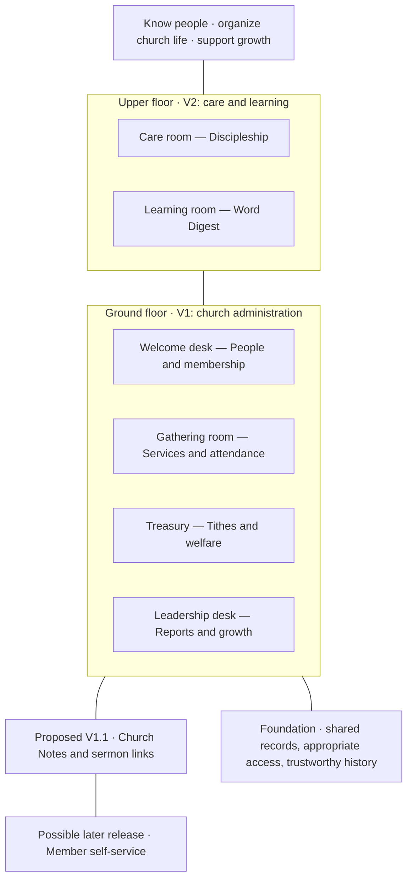

# Product vision and roadmap

[← Back to the Product Storybook](../product-storybook.md)

## The product as a house

The house is a way to understand the product, not a proposal for a literal house-shaped interface. Each room has a clear responsibility, and every room uses the same trusted people records.

The ground floor must be useful on its own. The upper floor adds structured care and learning without creating another people database.

## Who the product serves

One person may perform several roles.

| Person | What Eglise helps them do |
| --- | --- |
| Church administrator | Maintain records, prepare attendance and growth reports, and discuss findings with pastors and leaders. |
| Attendance leader | Record Sunday participation with minimal interruption. |
| Pastor or ministry leader | Discuss attendance, growth, church direction, and care coverage with the administrator. Pastors see financial totals without individual financial details. |
| Finance or welfare officer | Maintain restricted records and explain period totals. |
| Discipleship coordinator or discipler | Know who is responsible for each person and what follow-up is due. |
| Word Digest coordinator or facilitator | Manage learners, participation, results, and progression. |
| Visitor or member | Be recognized, supported, and guided, even before having direct application access. |

## Release story

### V1 — Run administration with reliable records

- Staff access and permissions.
- People and membership records.
- Spreadsheet import.
- Sunday service check-in and calculated attendance.
- Administrator-operated attendance and growth reports.
- Tithes, welfare contributions, and assistance given to members.
- Audit history, backups, and recovery.

Existing WhatsApp, Telegram, discipleship, and Word Digest processes continue outside the application during V1.

### Proposed V1.1 — Make existing resources easier to find

Curated Church Notes, sermon, and channel links may follow after the pilot. The audience and value still need agreement.

### V2 — See responsibility and progress

- Discipleship assignments and follow-up.
- Word Digest classes, attendance, assessments, and progression.
- Connected Assimilation cohort and membership recognition records.

### Possible later releases

- Member accounts and self-service details.
- QR check-in.
- Direct messaging integrations, if the existing channels leave a demonstrated gap.
- Multi-branch support.

These are product boundaries, not delivery dates.

## Product principles

- One shared person identity connects attendance, membership, care, learning, and permitted finance records.
- Access follows responsibility. Sensitive finance and welfare details are not visible merely because someone is a leader.
- Reports explain what they measure and what they exclude.
- Historical records retain the rule that applied at the time.
- The current phase is product discovery. GitHub tasks remain Todo until discussion is complete and implementation begins.

## Related chapters

- [People and membership](people-and-membership.md)
- [Sunday attendance and reporting](attendance-and-reporting.md)
- [Tithes and welfare](finance-and-welfare.md)
- [Discipleship and Word Digest](discipleship-and-word-digest.md)
- [Communication and later possibilities](communication-and-future.md)
- [End-to-end journeys](user-journeys.md)

Detailed rules and acceptance criteria live in [requirements.md](../requirements.md).
