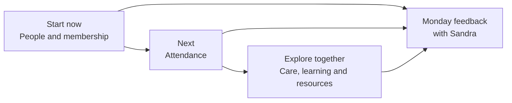

# Product vision and roadmap

[← Back to the Product Storybook](../product-storybook.md)

## The sequence

Eglise is deliberately moving from certainty to discovery:

**Confirmed:** one church, a shared people foundation, and iterative feedback. **Discovery:** the detailed workflows, data rules, and release order beyond the first two slices.

## Who it serves

| Person                                   | Current role in the picture                                                                                  |
| ---------------------------------------- | ------------------------------------------------------------------------------------------------------------ |
| Church administrator or designated staff | Maintains people records and helps shape the first attendance workflow.                                      |
| Attendance or event team                 | Records individual participation and/or an agreed headcount for each service or event.                       |
| Sandra, church representative            | Brings feedback and helps agree the next slice at the Monday cadence.                                        |
| Facilitators and ministry teams          | Discover the needs of Bible study, care-school, welfare, and resource work before those tools are specified. |
| Pastors and leaders                      | Use agreed summaries and guide boundaries; their detailed access is not yet decided.                         |

## Product principles

- Start with the smallest useful workflow and learn from the church's use of it.
- Keep one person record, but do not assume every module needs the same fields or audience.
- State whether a total is an individual count, a manually entered headcount, or both.
- Protect sensitive information by design; unresolved access, retention, permission, and export rules are blockers for sensitive rollout.
- Keep care-school activity separate from confidential clinic records.
- Preserve existing Telegram and WhatsApp practices until a replacement solves a demonstrated problem.

## Current scope picture

### Start now — people and membership

Manual entry, spreadsheet import, an adjustable age rule beginning at 16, shared phone numbers, private date of birth, and administrator-recorded membership recognition are confirmed foundations.

### Next — attendance

Attendance must support more than a single Sunday-only assumption: the church can use multiple services and other agreed event types. Individual attendance and a manual event/service headcount both need validation. Reporting definitions and DigiReach follow-up are discovery work.

### Explore together — care, learning, and resources

- Welfare: recurring home/mission support and emergency assistance.
- Bible study: materials derived from sermons, facilitator access, and participation.
- Care school: topics, progress, readiness, and booking.
- Resources: Church Notes, edited sermon-audio links, Telegram links, and announcements.

The Healing and Deliverance Clinic is not a general care feature: its forms, history, and reporting are separately restricted to designated ministers.

## Access and release posture

The pilot can operate with a temporary shared account. It cannot offer named attribution through that account. Eventual role-based access is the direction, but the permission matrix, audit model, retention, exports, and detailed privacy rules are unresolved and must be agreed before wider or sensitive use.

## Not a calendar promise

The headings above describe priority and discovery, not dates. Each Monday review can retain, refine, defer, or stop a proposed area based on evidence.
