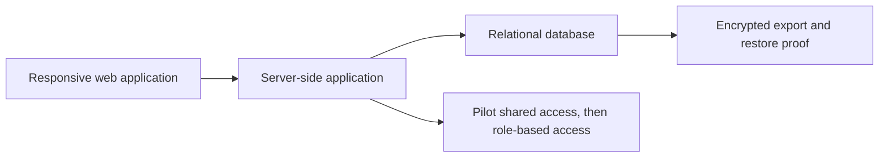

# Technical approach

[← Back to the Product Storybook](../product-storybook.md)

## Status

This is a proposed technical direction, not an implementation commitment. The product must first validate People and Membership, then Attendance, with Monday feedback from Sandra. The earlier stack exploration remains useful, but access and data-governance decisions from the stakeholder meeting supersede any claim that individual staff authentication is part of the immediate pilot.

## Confirmed operating constraints

- One-church pilot, product discovery first.
- Desktop-oriented administration and phone/tablet service or event entry over ordinary 3G.
- A temporary shared pilot account is allowed to lower setup friction. It provides no named action attribution.
- Eventual role-based access is the target. Permissions, audit attribution, retention, privacy notices, deletion, and exports are unresolved.
- Sensitive clinic information requires separately restricted designated-minister access and cannot be safely run through the shared account.
- The pilot budget direction, Supabase/Cloudflare exploration, and provider portability remain proposals to prove before implementation.

## Proposed architecture to prove

The existing working proposal is SvelteKit with TypeScript on Cloudflare Workers, PostgreSQL through Supabase and Hyperdrive, and encrypted off-provider logical backups in R2. Keep it behind server-side modules, portable SQL, versioned migrations, application-owned identifiers, and testable database boundaries. Browser code must not call product tables directly or rely on provider-specific generated APIs.

This remains a proposal until a synthetic-data proof demonstrates the actual workflow, recovery, performance, and free-tier viability. A change of provider is not a feature rewrite goal; it is a deliberately tested operational path.

## Access evolution

### Temporary pilot

One shared account may access only the low-risk pilot workflow agreed with the church. It must show that records are shared-account activity, not falsely attribute a change to an individual. Do not put clinic, sensitive welfare, or other workflow requiring named accountability behind it.

### Eventual role-based rollout

Before wider rollout, agree a permission matrix for administration, event attendance, reports, finance, welfare, facilitators, resource publishers, designated clinic ministers, and any member audience. Server-side authorization must enforce each scope on pages, requests, reports, and exports. The audit model must capture a verified individual actor, time, action, and permitted context.

## Data and privacy gates

No retention period, deletion/archive flow, correction process, consent/notice, export authority, or complete permission matrix has been agreed. These are product decisions, not implementation details. The system must minimise data; private dates of birth remain hidden from ordinary views, reports, exports, and audit messages.

For the clinic, agree designated-minister access, least privilege, audit visibility, incident handling, removal of access, and separate storage/views/exports before capturing forms or history.

## Workflow proof gates

Use synthetic data only. Before implementation expands, demonstrate:

1. People creation/import preview, duplicate review, shared-phone handling, and private age eligibility.
2. Flexible service/event setup with duplicate-safe individual attendance and a clearly labelled manual headcount path; prove reports do not add those measures together.
3. Desktop administration and a compact phone/tablet event-entry screen over throttled 3G.
4. The shared-account pilot limitation is visible, and no named attribution or sensitive workflow is claimed.
5. The proposed eventual role model rejects direct unauthorized requests, reports, and exports.
6. Encrypted backup/export and restoration into a disposable database, with no sensitive values in logs.
7. Provider-portability and free-tier usage evidence for the chosen stack.

## Performance and recovery targets to agree

The earlier targets—five seconds for a cold useful screen over throttled 3G, two seconds for a repeat shell, a 250 KB initial compressed transfer, and one-second search/save responses after arrival—are useful candidates. Validate them against real church devices, event conditions, data size, and concurrency before treating them as acceptance criteria. Agree recovery objectives and backup cadence before live records are loaded.
