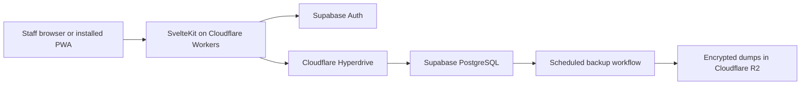

# Technical scope and decision record

[← Back to the README](../README.md) · [Detailed technical approach →](technical-approach.md)

## Purpose

This chapter gives product managers and stakeholders a concise record of the technical direction, why it was chosen, what V1 includes, and which risks have been accepted. It is a scope and decision document, not an implementation guide.

## Decision summary

Eglise will be a lightweight, installable web application for one church. Detailed administration is designed primarily for desktop and laptop use. Sunday check-in also works on phones and tablets over ordinary 3G.

The pilot targets zero recurring infrastructure cost. The church expects to pay only for its domain and use the free allowances from Supabase and Cloudflare.

## Chosen technology

| Concern | Decision | Reason |
| --- | --- | --- |
| Product shape | Responsive PWA | Serves desktop and mobile without separate native applications or app-store releases. |
| Application | SvelteKit with TypeScript | Supports server-rendered pages, progressive enhancement, and controlled JavaScript payloads. |
| Hosting | Cloudflare Workers | Global delivery, a suitable free allowance, and direct integration with Cloudflare services. |
| Database | Supabase Free PostgreSQL | Relational storage, constraints, transactions, familiar SQL, and a straightforward path to another PostgreSQL provider. |
| Database connection | Cloudflare Hyperdrive | Pools PostgreSQL connections from Workers and keeps database credentials out of browsers. |
| Authentication | Supabase Auth | Manages password verification and sessions without Eglise storing password hashes. |
| Authorization | Eglise server roles | Keeps church permissions and deactivation under application control. |
| Backups | Supabase logical dumps encrypted into R2 | Keeps recoverable copies outside the database provider. |
| Backup execution | Scheduled GitHub Actions workflow | Runs database tooling that is not available inside a Worker and records repeatable evidence. |

## Decisions and tradeoffs

### One application across devices

The administrator will use desktop for imports, tables, reports, reconciliation, finance, configuration, and batch work. Check-in is a compact service-day flow that also works on phones and tablets. Responsive design adapts each workflow rather than stretching a mobile layout across a desktop.

### Supabase and Cloudflare together

Cloudflare runs the application and stores off-provider backups. Supabase supplies PostgreSQL and authentication. Supabase Free pausing and availability are accepted pilot risks. If the pilot outgrows or cannot rely on Supabase, the application can move to another PostgreSQL provider using logical exports and versioned migrations.

### Username and password

Staff see an Eglise username and password. Supabase natively authenticates email or phone identifiers, so the server derives an internal email-form identifier from the normalized username. That identifier is never presented as a real contact address.

Only the first administrator uses the protected setup flow. After initialization, public signup remains disabled. Administrators create later staff accounts with temporary passwords and approved roles. Staff must change a temporary password at first sign-in.

### Provider portability

Supabase stays behind server-side application modules. Product screens do not query Supabase tables directly and do not depend on Supabase Realtime, Storage, Edge Functions, or generated APIs. Eglise owns its staff IDs, roles, status, domain records, migrations, and audit history.

Moving to another PostgreSQL provider should involve provisioning, restoring, configuration, and verification. A future authentication-provider change may require staff to create new passwords. Moving to D1 requires a controlled PostgreSQL-to-SQLite migration and is not a one-click switch.

## V1 technical scope

- Responsive desktop administration and phone/tablet check-in.
- Installable PWA manifest and cached application shell.
- Server-rendered and progressively enhanced core workflows.
- Supabase username/password authentication through the Eglise mapping.
- Protected first-administrator setup and closed public signup.
- Administrator-provisioned staff accounts, temporary passwords, password changes, recovery, and deactivation.
- Server-enforced application roles and audit history.
- PostgreSQL schema, constraints, migrations, indexes, and transaction boundaries.
- Encrypted off-provider backups with scheduled retention and tested restoration.
- Monitoring of Supabase and Cloudflare free-allowance usage.
- Automated formatting, linting, type checks, meaningful tests, and deployment verification.

## Outside V1 technical scope

- Native Android or iOS applications.
- Full offline synchronization.
- Member accounts and member self-service.
- QR check-in.
- Social login, passwordless login, or mandatory MFA.
- Direct WhatsApp or Telegram integration.
- Online payment collection.
- Multi-church tenancy.
- Paid infrastructure plans unless a later decision changes the budget.

## Quality gates before implementation expands

The disposable technical proof uses synthetic data and must demonstrate:

1. One-time administrator bootstrap and rejection of later setup attempts.
2. Username/password sign-in, forced temporary-password change, recovery, deactivation, and role enforcement.
3. Generic and throttled invalid-sign-in handling.
4. A 2,000-person indexed search over throttled 3G.
5. Duplicate-safe concurrent check-in.
6. One desktop import preview and one compact phone check-in screen.
7. An encrypted Supabase dump uploaded to R2 and restored into ordinary PostgreSQL.
8. Recorded transfer size, response time, storage, egress, Worker requests, and backup usage.

This proof validates the architecture. It does not use church data and is not the V1 implementation.

## Initial performance budgets

| Measure | Target to validate |
| --- | --- |
| Cold first useful screen over throttled 3G | Within 5 seconds. |
| Repeat PWA shell load | Within 2 seconds. |
| Initial compressed transfer | At most 250 KB. |
| Person search after the request reaches the application | Within 1 second. |
| Check-in confirmation after the request reaches the application | Within 1 second. |

## Accepted risks

- Supabase Free may pause or have availability limits.
- Free allowances have capacity and usage ceilings.
- Username sign-in requires an internal Supabase email-form identifier.
- Password recovery has no automatic email path in V1.
- The last administrator requires owner-controlled recovery.
- A change of authentication provider may require password re-enrollment.
- Full offline attendance synchronization is deferred.

## Ownership

The project owner, Elvis020, controls the first-administrator bootstrap secret and final-administrator recovery process. This owner-level access is separate from the Eglise administrator account and requires access to the deployment and Supabase project.

## Needed before implementation begins

- The intended domain or a temporary project subdomain.
- Access to the Cloudflare and Supabase projects; secrets remain in their secret stores and are never committed.
- A representative desktop and phone, or agreed device profiles, for the Ghana 3G performance proof.
- A Supabase region selected after a small latency check from Ghana.
- An anonymized sample spreadsheet for the import proof.

These inputs are not required to continue product discovery.

## Related documents

- [Detailed technical approach](technical-approach.md)
- [Product requirements](../requirements.md)
- [Product Storybook](../product-storybook.md)
- [GitHub Project](https://github.com/users/Elvis020/projects/8/views/1)
