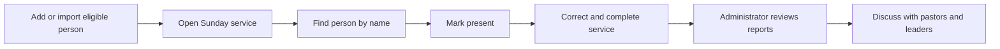

# End-to-end journeys

[← Back to the Product Storybook](../product-storybook.md)

## Ama's journey

Ama is an illustrative person who shows how the product areas connect. Her story does not mean every person follows the same path.

### 1. “I am new here”

Ama meets the configured minimum age and has access to a valid phone number. An administrator or designated leader enters her name, phone, and hidden date of birth. Alternatively, her valid record may already have been imported.

The product creates one shared person identity. It does not yet make her a member or give her an account.

### 2. “You remember me”

Staff find Ama by name and check her into a Sunday service. The service's recorded attendance increases by one.

When Ama returns on a different date within 30 days, the administrator's report recognizes her as a returning visitor. Attending two services on her first Sunday does not count as returning.

### 3. “Someone is walking with me”

In V2, a coordinator assigns Ama to a discipler. Follow-up and next actions become visible to the people responsible for her care.

### 4. “I am learning and becoming part of the church”

In V2, Ama moves through Word Digest. After the Assimilation cohort completes the agreed process, the administrator reviews the paperwork and marks eligible cohort members together.

If Ama's membership recognition is recorded within 90 days of her first visit, she contributes to the 90-day conversion measure. Attendance alone never changes her membership standing.

### 5. “I continue growing and contributing”

Ama may continue through other classes, contribute financially, receive welfare assistance, or later serve. These are possible paths, not requirements imposed on every person. Giving is never a condition of membership or care.

## A week in church administration

| Moment | What happens | What Eglise contributes |
| --- | --- | --- |
| Before Sunday | On a desktop or laptop, the administrator prepares services and adds or imports eligible people. | Sunday sessions and the shared people directory are ready. |
| During Sunday | Staff use a phone, tablet, or desktop to find people and mark them present, including over 3G. | Recorded attendance updates from individual check-ins. |
| After Sunday | Primarily on desktop, staff resolve mistakes and complete the service record. | Corrections remain traceable and summaries become reliable. |
| During the week | Administration, finance, and existing care processes continue. | V1 recordkeeping; V2 later adds care and learning visibility. |
| At month end | On desktop, the administrator prepares reports and sits with pastors and leaders. | 30-day return, 90-day conversion, attendance trends, and the agreed long-term retention comparison. |

## V1's central operational journey

## Open journey details

- Service-day devices, connectivity, and fallback.
- Long-term retention comparison periods.
- Exact spreadsheet mappings and migration history.
- Whether pastors and leaders need direct accounts for reports.
- Detailed finance fields, approvals, and reconciliation.

See [requirements.md](../requirements.md) for the decision register and acceptance criteria.
