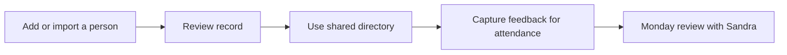

# End-to-end journeys

[← Back to the Product Storybook](../product-storybook.md)

## The immediate pilot journey

1. A designated staff member adds or imports a person using the confirmed name, phone, and private age-eligibility rules.
2. The church reviews whether the directory fits its real records, exceptions, and membership process.
3. The next slice tests attendance across the church's actual services or events, including individual records and/or manual headcounts as agreed.
4. Sandra brings feedback to the Monday review; the team records a decision and chooses the next smallest useful change.

## Attendance discovery journey

| Moment          | Question to test                                               | Guardrail                                             |
| --------------- | -------------------------------------------------------------- | ----------------------------------------------------- |
| Before an event | Which service/event is being recorded, and who is responsible? | Do not assume Sunday is the only event type.          |
| During it       | Is individual attendance, a manual headcount, or both needed?  | Label the source; do not double-count the two.        |
| After it        | Who reconciles mistakes or delayed records?                    | Preserve a clear correction history when roles exist. |
| Reporting       | What will leaders use to act, including DigiReach follow-up?   | Use definitions and incomplete-data warnings.         |

## Later discovery journeys

- A facilitator turns an agreed sermon into Bible-study material and records only the participation information the church needs.
- A welfare team considers recurring home/mission support or emergency assistance after reminder, approval, and privacy rules are agreed.
- A resource owner posts an announcement or Telegram link once the intended audience and publishing permissions are known.
- A designated minister uses the separate clinic process only after its restricted-access and retention decisions are approved.

## Pilot access caveat

The shared pilot account can support a low-friction test, but records created through it do not identify an individual actor. It must not be used for a workflow that needs named accountability, especially clinic or sensitive welfare information.
