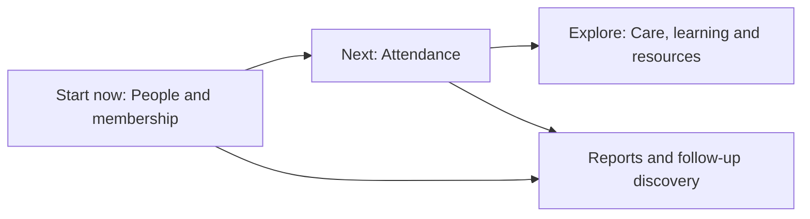

# Eglise Product Storybook

**Stage:** Product discovery. No product implementation has started.

## The product in one sentence

**Eglise helps a church know its people first, then learn—through real use—how attendance, care, learning, resources, and reporting should work together.**

## The current picture

The pilot begins with a shared people directory. Attendance follows once the event and headcount workflow has been tried with the church. Care, Bible study, welfare, resources, and announcements are explored in small, feedback-led slices rather than assumed from a release label.

## How decisions are made

Sandra represents the church in the feedback loop. The product team and church review progress on Mondays, capture what was learned, and agree the next smallest useful slice. A label of **Confirmed** means the meeting settled the direction; **Discovery** and **Open** mean the workflow still needs evidence.

## Access at the pilot stage

The pilot may use a shared account to reduce setup friction. Actions made through it are not attributable to a named person. That is a temporary limitation, not the target security model: a later rollout needs agreed role-based access, permissions, audit attribution, retention, and export rules.

## Read the book

| Chapter                                                                 | What it explains                                                                                 |
| ----------------------------------------------------------------------- | ------------------------------------------------------------------------------------------------ |
| [1. Product vision and roadmap](docs/product-vision.md)                 | The sequence, users, and confirmed versus discovery boundaries.                                  |
| [2. People and membership](docs/people-and-membership.md)               | The immediate directory, import, privacy, and membership rules.                                  |
| [3. Attendance and reporting](docs/attendance-and-reporting.md)         | Flexible services/events, manual and individual attendance, headcounts, and DigiReach discovery. |
| [4. Finance and welfare](docs/finance-and-welfare.md)                   | Contributions, recurring home/mission support, emergency assistance, and open controls.          |
| [5. Discipleship and Bible study](docs/discipleship-and-word-digest.md) | Sermon-derived study materials, facilitators, and participation discovery.                       |
| [6. Healing and deliverance](docs/healing-and-deliverance.md)           | A separate school and confidential clinic boundary.                                              |
| [7. Communication and future work](docs/communication-and-future.md)    | Telegram resources, announcements, and future access decisions.                                  |
| [8. End-to-end journeys](docs/user-journeys.md)                         | The smallest pilot flows and feedback loop.                                                      |
| [9. Technical scope](docs/technical-scope.md)                           | Pilot constraints and unresolved data-governance work.                                           |
| [10. Technical approach](docs/technical-approach.md)                    | The proposed architecture and proof gates.                                                       |

The [requirements](requirements.md) consolidate the detailed decision register. The [voice notes](notes/voice/voice_notes.md) remain preserved source material.
