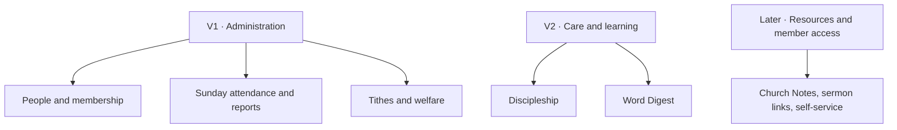

# Eglise Product Storybook

**Stage:** Product discovery. Implementation has not started.
**Purpose:** Give the church and product team a shared picture of what Eglise is, who it serves, and how its feature areas connect.

## The product in one sentence

**Eglise is a shared place where church administrators can know their people, organize church life, and give pastors and leaders a trustworthy picture of growth and care.**

## The picture

Think of Eglise as a house built on one shared people directory:

V1 helps the administrator run the church's core records. V2 connects those same people to care and learning. Later features are considered only after the pilot shows a real need.

The administrator will do most detailed work on a desktop. Service-day check-in must also work smoothly on phones and tablets, including ordinary 3G connections.

## Read the book

| Chapter | What it explains |
| --- | --- |
| [1. Product vision and roadmap](docs/product-vision.md) | The house, users, principles, and V1/V2 boundaries. |
| [2. People and membership](docs/people-and-membership.md) | Registration, spreadsheet import, hidden date of birth, adjustable age eligibility, and cohort membership recognition. |
| [3. Sunday attendance and reporting](docs/attendance-and-reporting.md) | Individual check-in, calculated attendance, 30-day visitor return, 90-day conversion, and longer-term retention. |
| [4. Tithes and welfare](docs/finance-and-welfare.md) | Tithes, welfare contributions, assistance, and privacy boundaries. |
| [5. Discipleship and Word Digest](docs/discipleship-and-word-digest.md) | V2 care assignments, follow-up, classes, results, and progression. |
| [6. Communication and later possibilities](docs/communication-and-future.md) | WhatsApp/Telegram decisions, resource links, member access, and deferred scope. |
| [7. End-to-end journeys](docs/user-journeys.md) | Ama's journey and a week in church administration. |
| [8. Technical approach](docs/technical-approach.md) | Desktop administration, mobile check-in, PWA delivery, and a domain-only operating budget. |

## What V1 looks like at a glance

1. An administrator adds an eligible person or imports them from a spreadsheet.
2. Staff open a Sunday service, find the person by name, and mark them present.
3. The system calculates recorded attendance from distinct check-ins.
4. The administrator corrects mistakes and reviews reports.
5. The administrator discusses attendance, visitor return, membership conversion, and retention with pastors and leaders.
6. Authorized finance and welfare staff maintain restricted records; pastors see totals only.

## Decisions already made

- One-church pilot.
- V1 administration first; discipleship and Word Digest in V2.
- Sunday services first, with other days configurable later.
- Individual check-in; the system calculates attendance.
- Required name, valid Ghanaian or international phone number, and hidden date of birth.
- Minimum registration age starts at 16 and is adjustable. Existing people retain eligibility after an increase.
- Shared phone numbers are allowed.
- Visitor return: another visit date within 30 days.
- Visitor-to-member conversion: administrator-recorded membership within 90 days.
- Administrators operate reports and discuss them with pastors and leaders.
- Tithes plus welfare contributions and assistance in V1. Pastors see financial totals only.
- WhatsApp and Telegram remain the communication channels for now.

## Current discussion, not implementation

The linked chapters describe the agreed product picture and remaining questions. [requirements.md](requirements.md) holds the detailed rules and acceptance criteria. [voice_notes.md](voice_notes.md) remains the preserved source conversation.

The [GitHub Project](https://github.com/users/Elvis020/projects/8/views/1) contains proposed Todo items. They stay Todo while we shape this book; their existence does not mean development has started.
